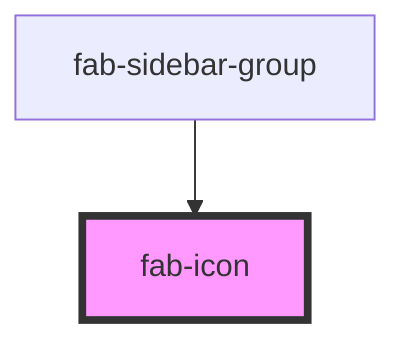

# fab-icon

<!-- Auto Generated Below -->

## Properties

| Property        | Attribute        | Description                                                                                                                  | Type                             | Default                                 |
| --------------- | ---------------- | ---------------------------------------------------------------------------------------------------------------------------- | -------------------------------- | --------------------------------------- |
| `class`         | `class`          | Custom CSS classes to apply to the icon wrapper.                                                                             | `string`                         | `undefined`                             |
| `fill`          | `fill`           | The fill color for the SVG. For duotone icons, this will be the primary color.                                               | `string`                         | `undefined`                             |
| `fillSecondary` | `fill-secondary` | The secondary fill color for duotone icons.                                                                                  | `string`                         | `undefined`                             |
| `icon`          | `icon`           | The name of the icon to display. This should correspond to an SVG file in the assets directory (without the .svg extension). | `string`                         | `undefined`                             |
| `size`          | `size`           | The size of the icon in pixels. Defaults to 16.                                                                              | `number`                         | `16`                                    |
| `stroke`        | `stroke`         | The stroke color for the SVG.                                                                                                | `string`                         | `'var(--primary-colour, currentColor)'` |
| `variant`       | `variant`        | The variant of the icon. Defaults to 'line'.                                                                                 | `"duotone" \| "line" \| "solid"` | `'duotone'`                             |

## Dependencies

### Used by

 - [fab-sidebar-group](../fab-sidebar-group)

### Graph

----------------------------------------------

*Built with [StencilJS](https://stenciljs.com/)*
