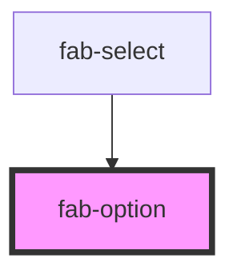

# fab-option

<!-- Auto Generated Below -->

## Properties

| Property      | Attribute     | Description                                                  | Type      | Default     |
| ------------- | ------------- | ------------------------------------------------------------ | --------- | ----------- |
| `description` | `description` | Description text for the option (for enhanced accessibility) | `string`  | `undefined` |
| `disabled`    | `disabled`    | Whether the option is disabled                               | `boolean` | `false`     |
| `icon`        | `icon`        | Optional icon class                                          | `string`  | `undefined` |
| `imageUrl`    | `image-url`   | Optional image URL for the option                            | `string`  | `undefined` |
| `selected`    | `selected`    | Whether the option is selected                               | `boolean` | `false`     |
| `value`       | `value`       | The option value                                             | `string`  | `''`        |

## Events

| Event             | Description                     | Type                  |
| ----------------- | ------------------------------- | --------------------- |
| `fabOptionSelect` | Emitted when option is selected | `CustomEvent<string>` |

## Dependencies

### Used by

 - [fab-select](../fab-select)

### Graph

----------------------------------------------

*Built with [StencilJS](https://stenciljs.com/)*
