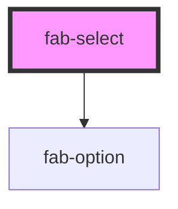

# fab-select

<!-- Auto Generated Below -->

## Properties

| Property         | Attribute         | Description                                                                                 | Type      | Default              |
| ---------------- | ----------------- | ------------------------------------------------------------------------------------------- | --------- | -------------------- |
| `collapsedCount` | `collapsed-count` | If multiple, how many options will be shown in the collapsed state before showing "+X more" | `number`  | `2`                  |
| `disabled`       | `disabled`        | Whether the select is disabled                                                              | `boolean` | `false`              |
| `multiple`       | `multiple`        | Whether multiple options can be selected                                                    | `boolean` | `false`              |
| `name`           | `name`            | The name of the form control (used for form submission)                                     | `string`  | `''`                 |
| `placeholder`    | `placeholder`     | Placeholder text to display when no option is selected                                      | `string`  | `'Select an option'` |
| `required`       | `required`        | Whether the select is required                                                              | `boolean` | `false`              |

## Events

| Event       | Description                    | Type                              |
| ----------- | ------------------------------ | --------------------------------- |
| `fabChange` | Emitted when selection changes | `CustomEvent<string \| string[]>` |

## Methods

### `getValue() => Promise<string | string[]>`

#### Returns

Type: `Promise<string | string[]>`

### `setValue(value: string | string[]) => Promise<void>`

#### Parameters

| Name    | Type                 | Description |
| ------- | -------------------- | ----------- |
| `value` | `string \| string[]` |             |

#### Returns

Type: `Promise<void>`

## Dependencies

### Depends on

- [fab-option](../fab-option)

### Graph

----------------------------------------------

*Built with [StencilJS](https://stenciljs.com/)*
