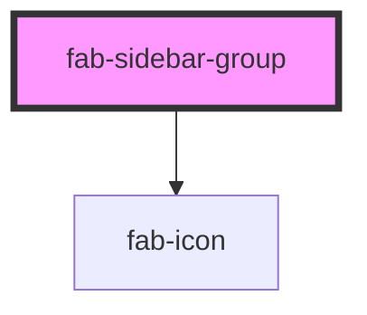

# fab-sidebar-group

<!-- Auto Generated Below -->

## Properties

| Property           | Attribute           | Description                               | Type      | Default     |
| ------------------ | ------------------- | ----------------------------------------- | --------- | ----------- |
| `groupCollapsed`   | `group-collapsed`   | Whether the group is currently collapsed. | `boolean` | `false`     |
| `groupCollapsible` | `group-collapsible` | Whether the group is collapsible.         | `boolean` | `false`     |
| `heading`          | `heading`           | Optional heading for the group.           | `string`  | `undefined` |

## Dependencies

### Depends on

- [fab-icon](../fab-icon)

### Graph

----------------------------------------------

*Built with [StencilJS](https://stenciljs.com/)*
